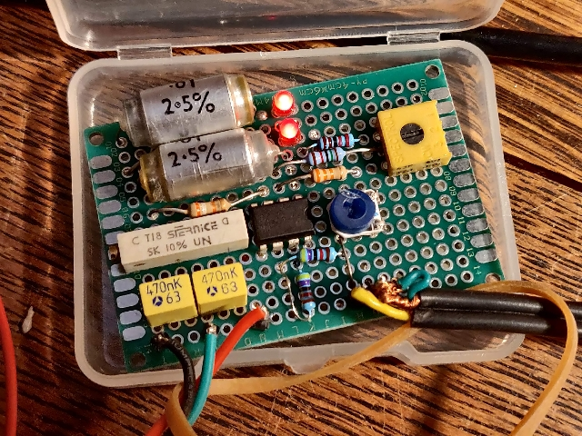
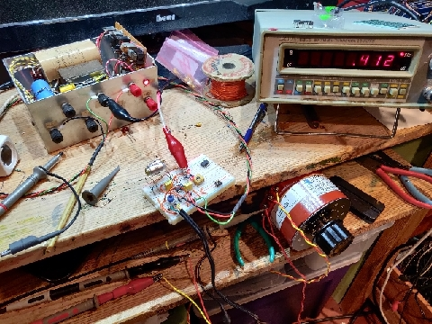
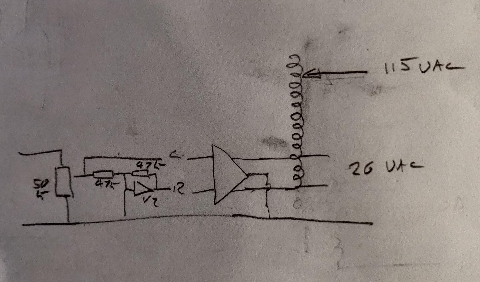
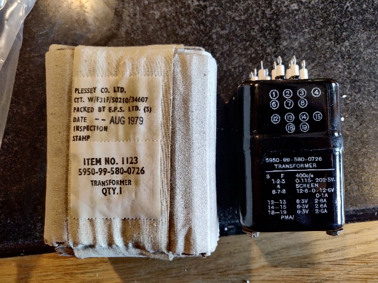
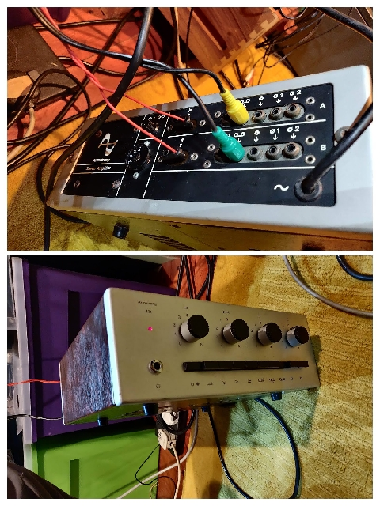
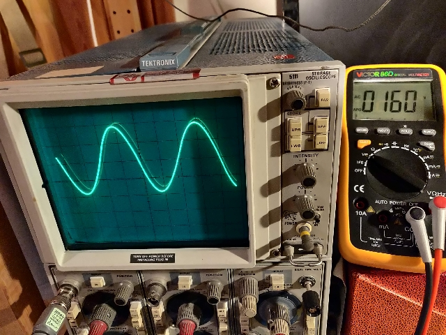
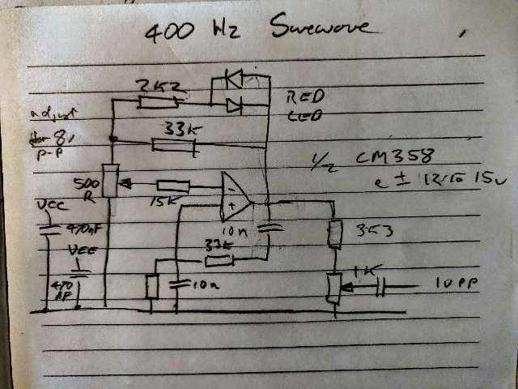
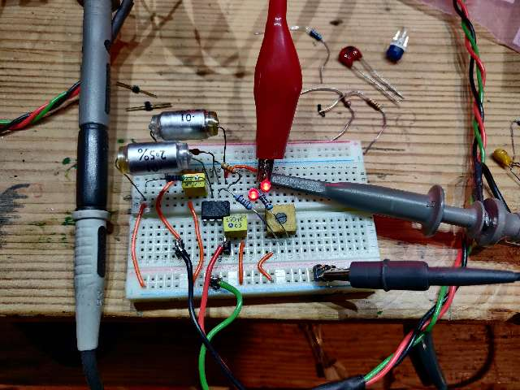
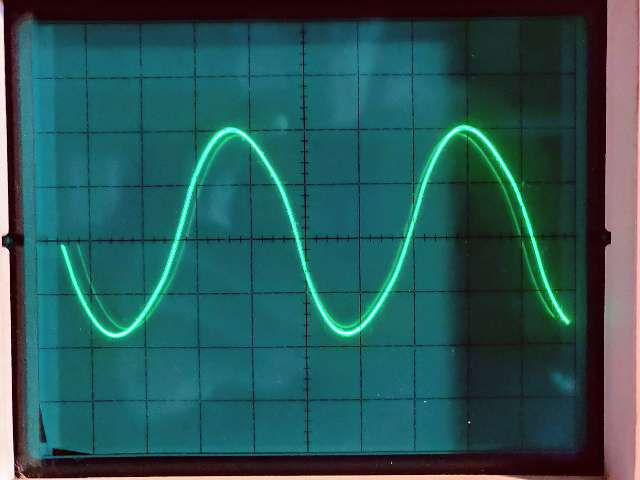

# Aviation_400Hz_PowerSupply

400 Hz 115 VAC power supply to feed aviation instruments.

Image shows oscillator and inverter follower for bi-phase output. Presets for oscillator amplitude, oscillator frequency, and output level.

## 400Hz Oscillator

The purpose of the oscillator is to drive an audio power amplifier feeding into a reverse connected low voltage 115 VAC 400Hz transformer.

### 2nd version

The oscillator feedback has been tweaked to reduce the distortion. An output level control has been added because the amplifier input stages were being over-driven with the full output of the oscillator. An inverting buffer have been added to allow the amplifier to operate in bridge mode for increased output, each channel input is driven with opposite phase signals and the output is connected between the two 'hot' outputs. The amplifier output is connected to a variable voltage transformer between the 112% input terminal and the 100% termianl. The resulting AC is available between the 0% and wiper terminals giving a continually variable output between 0 and maximum ( up to approx 230 when the amps are flat out ) higher voltage is available but the amps are clipping then and the waveform becomes square. A frequency trimmer will be added to the final soldered version to allow setting to 400 Hz.

A new transformer has arrived, it is seems to have better voltage stabilization than the variable auto transformer, another advantage is an additional isolated 25 volt secondary.

Dedicated 400Hz transformer

A 400 Hz mains transformer has been found and successfully used in reverse in the AC inverter instead of the variable auto transformer.

The three 6.3 V 2.6 A secondary windings have been wired in series and fed form the amplifier output.
115 VAC and 25 VAC are available on the secondary windings.

[transformer](./images/transformer-variable.jpg)

### 1st version

The red LEDS are part of the amplitude stabilizing feedback circuit.
The 33k and 10nF capacitors determine the frequency.
The op-amp is 1/2 of a LM358, a NE5532 was tried but stability was a problem - an 982 pF capacitor between op-amp + and - terminals helped eliminate the parasitic oscillation. LM358 does not need this.

Output is adjustable between +-3 to +-Vcc (12v)
Distortion is adequate judging by viewing waveform

Oscillogram shows output set to +-5 Vpp
